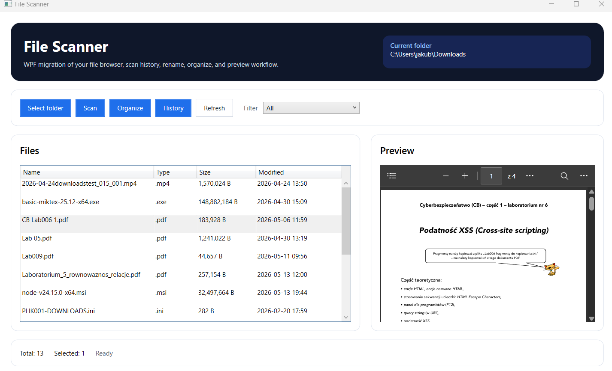
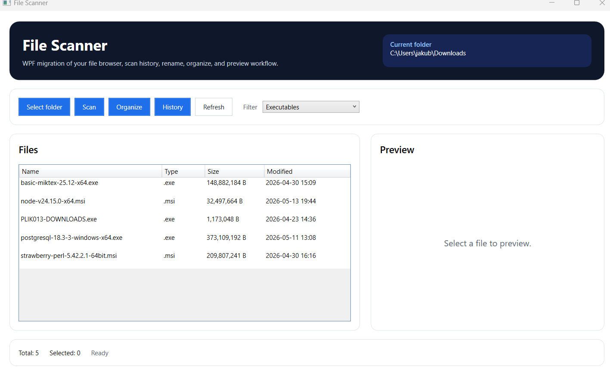
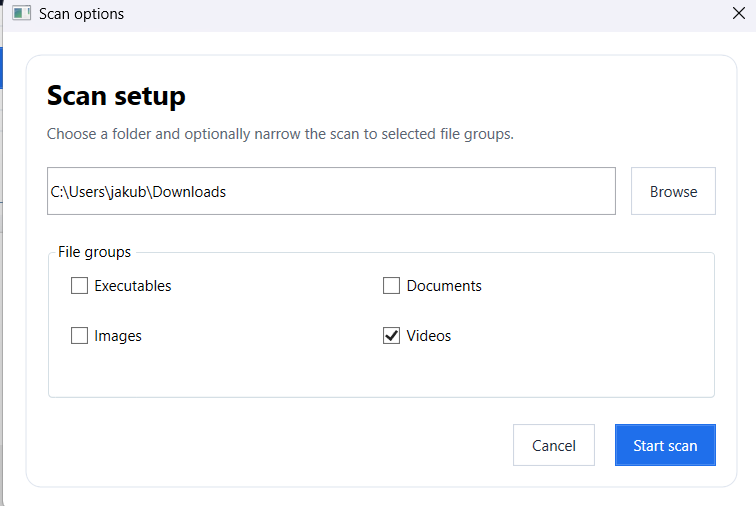
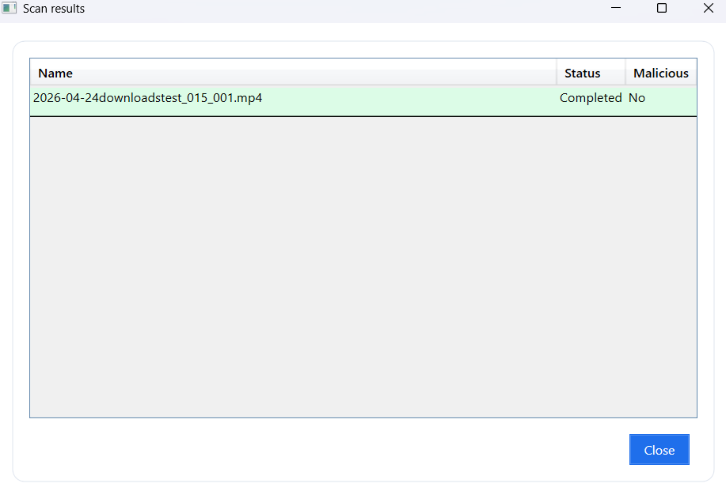
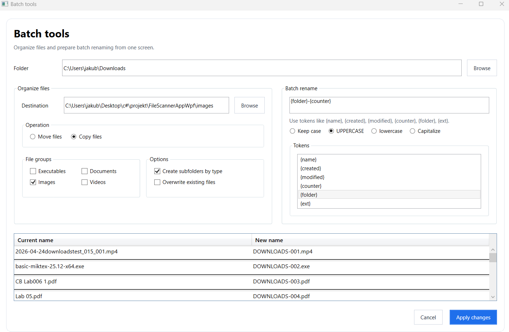
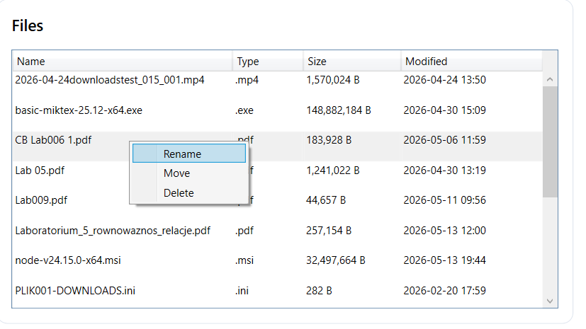
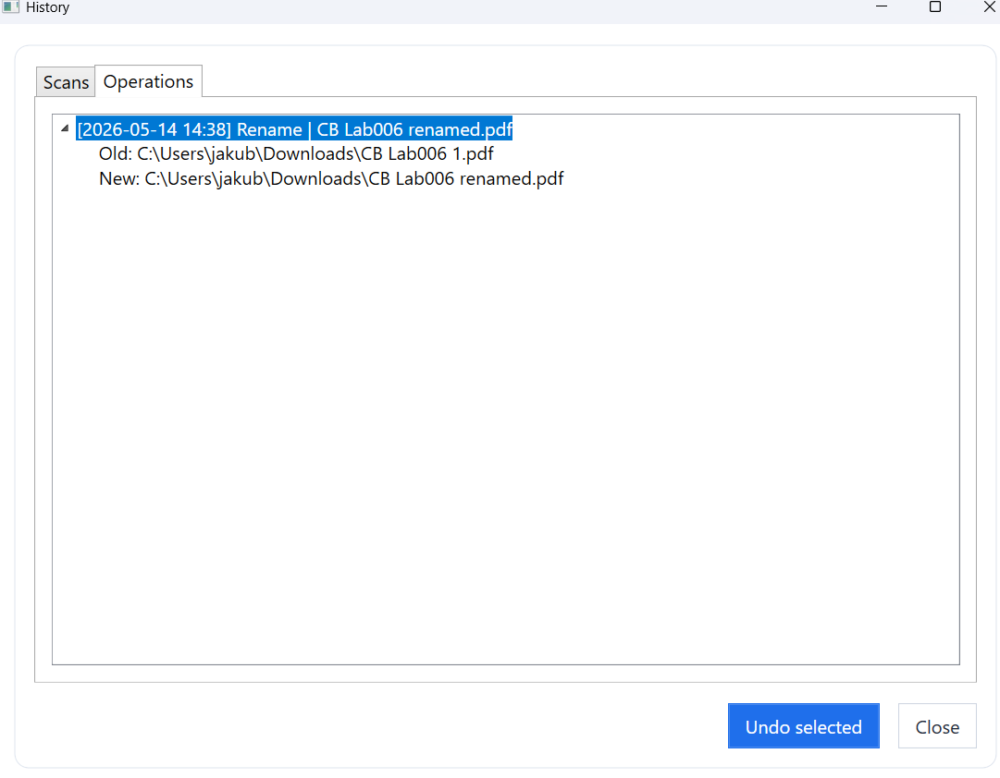

# Podręcznik użytkownika

FileScannerAppWpf służy do pracy z plikami w wybranym folderze. Użytkownik może przeglądać pliki, podglądać ich zawartość, skanować je przez VirusTotal, porządkować według typów, seryjnie zmieniać nazwy oraz sprawdzać historię operacji.

Najważniejszą funkcją aplikacji jest Organizer, dostępny w oknie `Batch tools`. Pozwala on szybko uporządkować większą liczbę plików, przenieść lub skopiować je do wybranego miejsca, utworzyć podfoldery według typów oraz seryjnie zmienić nazwy plików według ustalonego wzorca.

## Główne okno aplikacji

Po uruchomieniu aplikacji widoczne jest główne okno z paskiem przycisków, listą plików, panelem podglądu oraz informacjami o liczbie plików i postępie operacji.

Rysunek 1. Główne okno aplikacji z listą plików i panelem podglądu.

## Wybór folderu

1. Kliknij przycisk `Select folder`.
2. Wybierz folder, którego zawartość ma zostać wyświetlona.
3. Aplikacja załaduje pliki do tabeli.
4. W dolnej części okna zostanie pokazana łączna liczba plików.

Lista plików zawiera nazwę, typ, rozmiar oraz datę ostatniej modyfikacji. Po kliknięciu pliku aplikacja próbuje wyświetlić jego podgląd.

## Podgląd plików

Panel podglądu pokazuje zawartość wybranego pliku, jeżeli jego format jest obsługiwany. Aplikacja obsługuje między innymi obrazy, pliki tekstowe, multimedia, PDF oraz DOCX.

Jeżeli format nie jest obsługiwany albo plik nie istnieje, w panelu zostanie wyświetlony komunikat zamiast zawartości pliku.

## Filtrowanie plików

Lista plików może być filtrowana według typu. Użytkownik wybiera kategorię z listy rozwijanej, a aplikacja ogranicza widok do pasujących rozszerzeń.

Mechanizm filtrowania ułatwia pracę z dużymi folderami, w których znajdują się dokumenty, obrazy, filmy oraz pliki wykonywalne.

Rysunek 2. Lista plików po zastosowaniu filtra typu.

## Skanowanie plików

Skanowanie pozwala sprawdzić pliki przy użyciu usługi VirusTotal.

1. Wybierz folder z plikami.
2. Kliknij `Scan`.
3. W oknie `Scan options` wybierz grupy plików, które mają zostać sprawdzone.
4. Kliknij `Start scan`.
5. Aplikacja obliczy hash SHA-256 każdego pliku i pobierze raport z VirusTotal.
6. Po zakończeniu skanowania zostanie wyświetlone okno z wynikami.

Rysunek 3. Okno wyboru typów plików do skanowania.

Rysunek 4. Wyniki skanowania plików przez VirusTotal.

## Organizowanie plików

Funkcja `Organize` otwiera okno narzędzi `Batch tools`. Jest to najważniejszy element aplikacji, ponieważ pozwala szybko uporządkować dużą liczbę plików bez ręcznego przenoszenia ich jeden po drugim.

Użytkownik może wybrać folder docelowy, tryb operacji oraz grupy plików, które mają zostać przetworzone.

Dostępne tryby:

- `Move files` - przenosi pliki do folderu docelowego.
- `Copy files` - kopiuje pliki do folderu docelowego.

Dostępne opcje:

- `Create subfolders by type` - tworzy podfoldery dla kategorii plików.
- `Overwrite existing files` - pozwala nadpisać istniejące pliki w folderze docelowym.

Jeżeli nadpisywanie jest wyłączone, aplikacja rozwiązuje konflikt nazw przez dopisanie numeru do nazwy pliku.

Rysunek 5. Okno organizowania plików z wyborem folderu docelowego i kategorii.

## Seryjna zmiana nazw

W oknie `Batch tools` dostępna jest sekcja `Batch rename`. To druga część Organizera, która pozwala seryjnie zmieniać nazwy wielu plików według jednego wzorca. Dzięki temu użytkownik może szybko ujednolicić nazwy dokumentów, zdjęć, filmów lub innych plików.

Użytkownik wpisuje wzorzec nowej nazwy, wybiera opcje wielkości liter i sprawdza podgląd zmian w tabeli przed wykonaniem operacji.

Dostępne znaczniki:

| Znacznik | Znaczenie |
| --- | --- |
| `{name}` | Oryginalna nazwa pliku bez rozszerzenia |
| `{created}` | Data utworzenia pliku |
| `{modified}` | Data ostatniej modyfikacji |
| `{counter}` | Numer porządkowy |
| `{folder}` | Nazwa folderu źródłowego |
| `{ext}` | Rozszerzenie bez kropki |

## Operacje z menu kontekstowego

Po zaznaczeniu pliku na liście użytkownik może skorzystać z menu kontekstowego.

Dostępne operacje:

- `Rename` - zmiana nazwy pojedynczego pliku.
- `Move` - przeniesienie pliku do innego folderu.
- `Delete` - przeniesienie pliku do wewnętrznego kosza aplikacji.

Operacje, które mogą zostać odtworzone, są zapisywane w historii.

Rysunek 6. Menu kontekstowe z operacjami dostępnymi dla zaznaczonego pliku.

## Historia skanów i operacji

Przycisk `History` otwiera okno historii. Okno zawiera dwie zakładki:

- `Scans` - historia skanowań i wyniki plików.
- `Operations` - historia operacji wykonanych na plikach.

W zakładce operacji można wybrać wpis i kliknąć `Undo selected`, jeżeli dana operacja może zostać cofnięta.

Rysunek 7. Okno historii skanów i operacji.

## Role w systemie

Aplikacja nie posiada systemu logowania ani podziału na role. Każdy użytkownik ma dostęp do tych samych funkcji.

## Przypadki brzegowe

| Sytuacja | Zachowanie aplikacji |
| --- | --- |
| Brak wybranego folderu | Lista plików pozostaje pusta, a aplikacja informuje, że folder nie został wybrany |
| Brak internetu | Skanowanie VirusTotal nie może pobrać raportów z usługi zewnętrznej |
| Brak klucza API | Zapytania do VirusTotal nie zostaną poprawnie autoryzowane |
| Plik został usunięty poza aplikacją | Operacja jest pomijana albo oznaczana jako nieudana |
| Konflikt nazw w folderze docelowym | Plik jest pomijany albo otrzymuje nazwę z licznikiem, zależnie od funkcji i ustawień |
| Nieobsługiwany format podglądu | Panel podglądu wyświetla komunikat o braku obsługi formatu |
| Plik usunięty trwale | Cofnięcie operacji nie jest już możliwe |

## Dane przechowywane przez aplikację

Aplikacja przechowuje dane lokalnie w bazie SQLite. Są to:

- historia skanów,
- wyniki skanowania plików,
- statusy plików,
- odpowiedzi API VirusTotal,
- historia operacji na plikach,
- ścieżki plików przed i po operacji,
- informacja, czy operację można cofnąć.

## Zachowanie na mniejszych oknach

Aplikacja jest programem desktopowym WPF, dlatego nie posiada wersji mobilnej. Przy zmniejszeniu okna najważniejsze jest zachowanie czytelności listy plików, panelu podglądu oraz przycisków.

Rysunek 8. Zachowanie interfejsu po zmniejszeniu okna aplikacji.

## Najważniejszy mechanizm aplikacji

Najważniejszym mechanizmem aplikacji jest Organizer, czyli zestaw narzędzi wsadowych dostępnych w oknie `Batch tools`. Jego głównym zadaniem jest szybkie porządkowanie plików oraz seryjna zmiana ich nazw.

Organizer jest szczególnie przydatny, gdy użytkownik ma folder z dużą liczbą różnych plików i chce szybko doprowadzić go do porządku. Zamiast ręcznie przenosić każdy plik, aplikacja może przenieść lub skopiować wybrane typy plików do folderu docelowego, a opcjonalnie także utworzyć podfoldery według kategorii.

Druga ważna część Organizera to seryjna zmiana nazw. Użytkownik może zdefiniować wzorzec nazwy, wykorzystać znaczniki takie jak `{name}`, `{counter}`, `{created}`, `{modified}`, `{folder}` lub `{ext}`, a następnie sprawdzić podgląd zmian przed ich zastosowaniem.

Proces korzystania z Organizera wygląda następująco:

1. Użytkownik wybiera folder z plikami.
2. Otwiera okno `Batch tools` za pomocą funkcji `Organize`.
3. Wybiera tryb działania: przenoszenie, kopiowanie albo seryjną zmianę nazw.
4. Wskazuje typy plików, folder docelowy lub wzorzec nowej nazwy.
5. Sprawdza podgląd zmian.
6. Uruchamia operację.
7. Aplikacja porządkuje pliki lub zmienia ich nazwy zgodnie z wybranymi ustawieniami.
